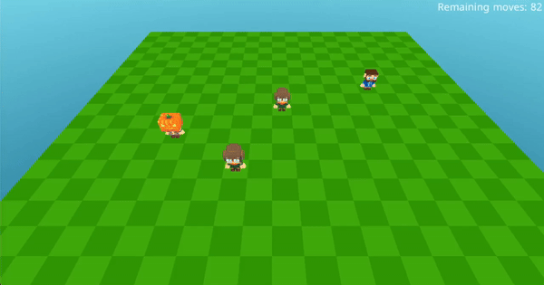

# Dojo Cubzh SDK Starter

<div align="center">
  <a href="https://app.cu.bzh/?script=github.com/cubzh/dojo-cubzh-sdk-starter">
    
  </a>
  <p></p>
  
</div>

This repository is a starter pack to start building your game using Cubzh and the Dojo SDK.

[Dojo](https://github.com/dojoengine/dojo) is a powerful game engine designed to create fully on-chain games, leveraging blockchain technology to ensure transparency, ownership, and decentralized gameplay. It allows developers to build complex game logic and state management directly on the blockchain.

[Cubzh](https://github.com/cubzh/cubzh) complements Dojo beautifully as a frontend solution for several reasons: it uses Lua, a language known for its simplicity and ease of learning, making it accessible to both novice and experienced developers. Additionally, Cubzh's voxel-based graphics system, where everything is constructed from cubes, provides a unique and charming aesthetic that's easy to work with. Furthermore, Cubzh boasts a vibrant community of creators who have produced a vast array of pre-made items and assets, significantly speeding up the game development process and allowing developers to focus on implementing their unique game mechanics and integrating with Dojo's on-chain capabilities.

This project uses the [dojo-starter](https://github.com/dojoengine/dojo-starter) project that setups simple methods to spawn a character and to move on a grid.

The file `world.lua` contains the Cubzh code that replicate what is written on-chain and that controls the movement of one character.

## Backend Setup with Dojo

1. Install Dojo version 1.0.0-alpha.12
   ```
   curl -L https://install.dojoengine.org | bash
   dojoup --version v1.0.0-alpha.12
   ```
2. Clone the Dojo starter repository:
   ```
   git clone https://github.com/dojoengine/dojo-starter
   ```
3. Run Katana locally on a new terminal (this is a local blockchain)
   ```
   katana --disable-fee --allowed-origins "*"
   ```
4. Build the project:
   ```
   sozo build
   ```
5. Comment out the `world_address` in `Scarb.toml`
6. Deploy the contracts on your local Katana:
   ```
   sozo migrate apply
   ```
7. Start Torii:
   ```
   torii --world 0x5d475a9221f6cbf1a016b12400a01b9a89935069aecd57e9876fcb2a7bb29da --allowed-origins "*"
   ```
8. Uncomment `world_address` in `Scarb.toml` and replace with the correct world address:
   ```
   world_address = "0x5d475a9221f6cbf1a016b12400a01b9a89935069aecd57e9876fcb2a7bb29da"
   ```

## Frontend Update (Cubzh)

1. Fork this repository
2. Your version of the game is now accessible at `https://app.cu.bzh/?script=github.com/<username>/<repo>:<commithash>`
3. Update the "Play" button URL in the README (replace with URL of your fork)
4. Visit your Github repository page and click "Play"
5. Make desired changes in `world.lua`
6. Push your changes and access your version at:
   ```
   https://app.cu.bzh/?script=github.com/<username>/<repo>:<commithash>
   ```
   Note: Include the commit hash to bypass the one-day cache.

## Code Overview

The `world.lua` file contains the following key components:

1. Module Import: Imports the "dojo" module from a GitHub repository
2. World Configuration: Sets up game world parameters
3. Constants: Defines game constants like directions and avatar names
4. Global Variables: Declares entities and remaining moves
5. Dojo Functions: Implements functions to interact with the Dojo backend
6. Dojo Callbacks: Handles updates from the Dojo backend
7. Entity Management: Functions for creating and managing game entities
8. Cubzh Hooks: Defines the `Client.OnStart` function
9. Game Initialization: Sets up the game map, camera, and UI
10. Controls: Handles player movement inputs

## Cubzh Dojo SDK

This Cubzh version integrates the `dojo.c` SDK to connect to Katana and Torii.

There are functions exposed in the Dojo global variable but it is easier to use the lua dojo module built on top.

Here are the useful functions of the module used in this example:

```lua
-- example config:
local worldInfo = {
    rpc_url = "http://localhost:5050",
    torii_url = "http://localhost:8080",
    world = "0x5d475a9221f6cbf1a016b12400a01b9a89935069aecd57e9876fcb2a7bb29da",
    actions = "0x025d128c5fe89696e7e15390ea58927bbed4290ae46b538b28cfc7c2190e378b",
    playerAddress = "0xb3ff441a68610b30fd5e2abbf3a1548eb6ba6f3559f2862bf2dc757e5828ca",
    playerSigningKey = "0x2bbf4f9fd0bbb2e60b0316c1fe0b76cf7a4d0198bd493ced9b8df2a3a24d68a",
}
```

1. `dojo:createToriiClient(config)`
    - Creates a Torii client using the provided configuration.
    - Stores the configuration and created client in the dojo object.
    - Sets up an OnConnect callback for the client.
    - Initiates the connection to the Torii client.

2. `dojo:createBurner(config, cb)`
    - Creates a burner account using the Torii client.
    - Takes a configuration object and a callback function as parameters.
    - Calls the callback with success status and error message if applicable.
    - Stores the created burner account in `dojo.burnerAccount` if successful.

3. `dojo:getModel(entity, modelName)`
    - Retrieves a specific model from an entity object.
    - Takes an entity object and a model name as parameters.
    - Returns the model if found, or nil if not found.

### Callbacks

```lua
function dojoUpdatePosition(key, position) end
function dojoUpdateRemainingMoves(key, moves) end

local callbacksExample = {
    ["dojo_starter-Position"] = dojoUpdatePosition,
    ["dojo_starter-Moves"] = dojoUpdateRemainingMoves,
}
```

1. `dojo:syncEntities(callbacks)`
    - Synchronizes entities and triggers callbacks for existing entities.
    - Takes a table of callbacks, similar to setOnEntityUpdateCallbacks.
    - Fetches up to 1000 entities from the Torii client and processes them with the provided callbacks.

2. `dojo:setOnEntityUpdateCallbacks(callbacks)`
    - Sets up callbacks for entity updates.
    - Takes a table of callbacks, where keys are model names and values are callback functions.
    - Uses the Torii client to listen for entity updates and triggers appropriate callbacks.

### Need more control over the SDK?

You can open the module [here](https://github.com/caillef/cubzh-library/blob/main/dojo/dojo_module.lua) and check how the Dojo table is used

## Getting Started

To run this project:

1. Follow the backend setup instructions above
2. Fork this repository
3. Update the README link in the play button to point to your forked repository
4. Visit the Cubzh link provided at the top of this README to play the game

## Contributing

Contributions are welcome! Please feel free to submit a Pull Request.
